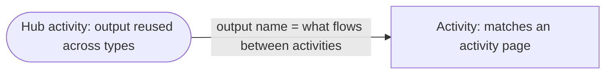
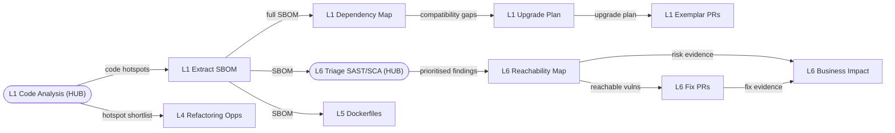
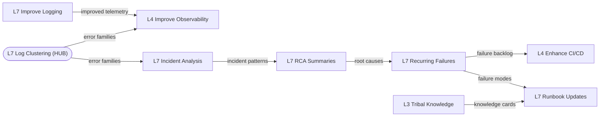
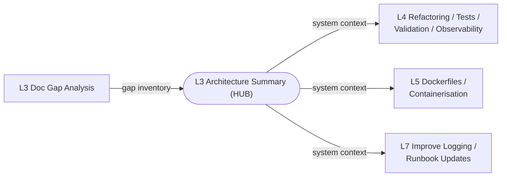

# Pilot Planning Guide: Composing Activities Across Legacy Types

Version: 0.1
Date: 17 Mar 2026

---

## Pilot Orchestrator Agent

The **Pilot Orchestrator** agent automates pilot lifecycle management—initialization, activity sequencing, state tracking, artefact validation, and reporting. Use it to manage your pilot.

### When to use the agent

Use the **Pilot Orchestrator** whenever you:
- Start a new pilot (it initializes structure and selects in-scope activities)
- Resume an existing pilot (it loads your state and shows next actions)
- Complete an activity offline (it validates artefacts before marking `done`)
- Need to coordinate across multiple legacy types and systems
- Want automated dependency tracking and phase gating
- Need final pilot reporting (it delegates private-report generation to the Report Synthesiser)

### How the agent supports your pilot plan

The Pilot Orchestrator:

1. **Reads LITRAF scores** and maps them to legacy types and activity clusters (next section)
2. **Initializes tracker and state files** mapping all activities, dependencies, and target systems
3. **Tracks hub activities** that serve multiple legacy types, ensuring they are run first to maximize reuse
4. **Sequences activities** respecting dependencies and phase gates (Prepare → Assess → Execute → Evaluate → Report)
5. **Validates artefacts** using the Pilot Artefact Gatekeeper before marking activities complete
6. **Unblocks downstream activities** when shared outputs are ready
7. **Provides resumability** so you can pause and return without losing context
8. **Generates final reports** from stored evidence, not from chat memory

### Typical pilot workflow with the agent

1. **Session 1 (Prepare):** Provide LITRAF report to Pilot Orchestrator → agent initializes and selects activities based on this guide's clusters
2. **Session 2 (Assess):** Complete Assess phase activities offline → provide outputs to agent for validation
3. **Sessions 3-N (Execute):** Pick `ready` activities from agent's tracker → complete offline using activity pages → submit artefacts to agent for validation and state update
4. **Session N+1 (Evaluate):** Provide evaluation evidence to agent
5. **Session N+2 (Report):** Agent delegates to Report Synthesiser for the private DSIT report

See **README.md** for detailed agent usage workflows (new pilot, resume, execution, reporting).

---

## Migration Orchestrator Agent (legacy migration workflow)

Use the migration-specific orchestrator when your goal is a controlled, slice-based system migration with explicit gates and resumable state.

Primary agent:

- [Migration Orchestrator](reusable-agents/legacy-migration/migration-orchestrator.agent.md)

Subagent chain it coordinates:

1. [Legacy System Analyst](reusable-agents/legacy-migration/legacy-system-analyst.agent.md)
2. [Target Architecture and Intent](reusable-agents/legacy-migration/target-architecture-intent.agent.md)
3. [Behaviour Baseline and Characterisation Testing](reusable-agents/legacy-migration/behaviour-baseline-characterisation-testing.agent.md)
4. [Migration Planner and Slice Designer](reusable-agents/legacy-migration/migration-planner-slice-designer.agent.md)
5. [Slice Implementer Agent (Worker)](reusable-agents/legacy-migration/slice-implementer-worker.agent.md)
6. [PR Quality Gate Agent](reusable-agents/legacy-migration/pr-quality-gate-verification.agent.md)
7. [Drift and Retrospective Learning Agent](reusable-agents/legacy-migration/drift-retrospective-learning.agent.md)

### Start a new migration

1. Select Migration Orchestrator in Copilot Chat.
2. Provide:
  - migration ID and type
  - target system(s)
  - build and test commands
  - known constraints and approvals
3. Ask to initialize migration state.
4. The orchestrator creates `.github/migrations/<migration-id>/` with state, tracker, and phase folders.

Suggested prompt:

"Start migration `<migration-id>` for `<system-name>`. Initialize tracker/state and begin discover phase. Build/test commands: `<commands>`."

### Continue an in-progress migration

1. Select Migration Orchestrator.
2. Ask to resume with the same migration ID.
3. The orchestrator loads `state.yaml` and `tracker.md` and reports:
  - current phase and gate status
  - ready work
  - waiting-on-human work
  - blocked items
  - next required action

Suggested prompt:

"Resume migration `<migration-id>` and list gate status, ready slices, blockers, and next action."

### Gate and slice execution behavior

The orchestrator enforces:

1. No execution before baseline tests are recorded.
2. No planning closure before slice acceptance criteria are explicit and approved.
3. No slice completion without PR quality gate evidence.
4. PR gate FAIL loops back to Slice Implementer.
5. PR gate PASS routes to human merge decision and tracked state update.

### Resumability contract

Each subagent returns a checkpoint block used to update `state.yaml` and `tracker.md`. If checkpoint data is missing, phase advancement is blocked. This allows users to jump in and out without losing operational continuity.

---

## 1) Purpose

The activity pages are organised by legacy type (L1 to L7), but real government systems rarely score on just one LITRAF criterion. A department's HR platform might be simultaneously out of support (L1), have known security vulnerabilities (L6), and lack documentation (L3). Running all three activity sets in isolation wastes effort because they share foundational outputs.

This guide helps teams:

- Identify which legacy types apply to the target system.
- Select the right combination of activities.
- Plan a multi-type pilot that shares outputs across activity chains.
- Estimate total effort realistically.

For architecture-related activities in this repository, users should start with the `Architecture Docs and Governance Orchestrator`. The orchestrator is the single user entrypoint and it invokes internal review, ADR, drift, and consistency stages automatically when needed.

---

## 2) From LITRAF scores to activity selection

The Legacy IT Risk Assessment Framework (LITRAF) scores every system on seven likelihood criteria (L1 to L7) using a 1 to 6 scale. A score of 3 (Medium) or above on any criterion means the system is considered legacy on that dimension.

**Use the system's LITRAF scores to select activity sets:**

| LITRAF Criterion | Score >= 3? | Activity Set |
|---|---|---|
| L1 End of Life / End of Support | Yes | [L1 activities](L1-Software-Out-of-Support/) |
| L2 Expired Vendor Contract | Yes | [L2 activities](L2-Expired-Vendor-Contracts/) |
| L3 Lack of Knowledge and Skills | Yes | [L3 activities](L3-Not-Enough-Knowledge-or-Skills-Available/) |
| L4 Inability to Meet Business Needs | Yes | [L4 activities](L4-Cannot-Meet-Current-or-Future-Business-Needs/) |
| L5 Unsuitable Physical Environment | Yes | [L5 activities](L5-Unsuitable-Hardware-or-Physical-Environment/) |
| L6 Known Security Vulnerabilities | Yes | [L6 activities](L6-Known-Security-Vulnerabilities/) |
| L7 Historically Recorded Issues | Yes | [L7 activities](L7-Recent-Failures-or-Downtime/) |

If a system scores >= 3 on multiple criteria, select activities from all relevant types and use this guide to compose them into a single pilot plan.

Not every activity within a selected type needs to be run. The team should choose activities based on the specific pilot hypotheses agreed during the Assess phase.

---

## 3) Common type clusters

These combinations occur frequently in practice. The rationale explains why they co-occur.

### Cluster A: L1 + L6 - "Unpatched and exposed"
**Rationale:** Out-of-support software cannot receive security patches, so known vulnerabilities accumulate. Almost every L1 system also scores on L6.

**Typical pilot focus:** Extract the SBOM, triage vulnerabilities against actual code usage (reachability), produce exemplar upgrade PRs and security fix PRs, and translate the highest-risk findings into business impact for decision-makers.

### Cluster B: L1 + L3 - "Old tech, no one left who knows it"
**Rationale:** When technology is old enough to be out of support, the engineers who built it have often moved on. Knowledge exists only as tribal memory.

**Typical pilot focus:** Document the system and its architecture, capture tribal knowledge from remaining SMEs, extract the SBOM and dependency map, and produce an upgrade plan the team can actually follow.

### Cluster C: L1 + L3 + L6 - "Full technical debt"
**Rationale:** The most common cluster for red-rated systems. Combines software out of support, skills gaps, and security vulnerabilities.

**Typical pilot focus:** All the activities from Clusters A and B, plus security triage and risk translation for senior stakeholders.

### Cluster D: L4 + L3 - "Can't change, don't understand"
**Rationale:** Systems that cannot meet business needs are often also poorly documented. The team cannot make safe changes because they do not understand the system well enough.

**Typical pilot focus:** Architecture summary and documentation, change impact mapping, refactoring opportunities, exemplar tests and refactors, CI/CD enhancement.

### Cluster E: L4 + L3 + L7 - "Can't change, keeps breaking"
**Rationale:** Systems that are hard to change also tend to break when changes are attempted. Recent failures provide evidence for where to focus.

**Typical pilot focus:** Cluster D activities plus log clustering, incident analysis, RCA summaries, and runbook updates.

### Cluster F: L5 + L1 + L3 - "Migration needs everything"
**Rationale:** Migration to new infrastructure requires understanding the current system (L3), its dependencies (L1), and the target environment (L5).

**Typical pilot focus:** Migration readiness assessment, architecture summary, SBOM extraction, migration options, containerisation exemplar, feasibility evaluation.

---

## 4) Shared outputs and effort savings

Several activities produce outputs that serve multiple legacy types. When running a multi-type pilot, these **hub activities** are done once and their outputs are reused across activity chains.

### Hub activities

Architecture workflow note:
- When a hub activity requires architecture generation, architecture update, legacy inference, or architecture validation, use the [Architecture Docs and Governance Orchestrator](reusable-agents/architecture/architecture-docs-governance.agent.md).
- Do not route users directly to the supporting architecture subagents. The orchestrator handles those phases internally.

| Activity | Legacy Type | Consumed by | What it provides |
|---|---|---|---|
| [Architecture Summary](L3-Not-Enough-Knowledge-or-Skills-Available/L3-Architecture-Summary.md) | L3 | L4 (5 activities), L5 (5 activities), L6 (2 activities), L7 (1 activity) | System-level context: component boundaries, interactions, dependencies, hotspots. |
| [Extract SBOM](L1-Software-Out-of-Support/L1-Extract-SBOM.md) | L1 | L5 (2 activities), L6 (1 activity) | Dependency inventory: component names, versions, licences, EOL status. |
| [Autonomous Code Analysis](L1-Software-Out-of-Support/L1-Autonomous-Code-Analysis.md) | L1 | L4 (1 activity), L6 (1 activity) | Hotspot shortlist: complexity, duplication, deprecated APIs. |
| [Log Clustering](L7-Recent-Failures-or-Downtime/L7-Log-Clustering.md) | L7 | L4 (1 activity), L3 (1 activity) | Error families: ranked clusters of recurring log errors. |
| [Triage SAST/SCA](L6-Known-Security-Vulnerabilities/L6-Triage-SAST-SCA.md) | L6 | L6 (3 activities) | Filtered, prioritised vulnerability list (also benefits from L1-SBOM as input). |

### Effort savings from shared outputs

Running multiple types together costs less than the sum of their individual timeboxes because hub activities are executed once. Approximate savings:

| Combination | Gross effort | Shared activities | Estimated saving | Net effort |
|---|---|---|---|---|
| L1 + L6 | 2.5-3 days | SBOM feeds both chains; Code Analysis surfaces security hotspots for L6 triage | half a day | 2-2.5 days |
| L1 + L3 | 3-3.5 days | Architecture Summary provides context for L1 upgrade planning; SBOM enriches L3 documentation | half a day | 2.5-3.5 days |
| L1 + L3 + L6 | 4.5-5.5 days | SBOM serves L1+L6; Architecture Summary serves L1+L6; Code Analysis serves L1+L6 | half a day to 1 day | 4-5 days |
| L4 + L3 | 3.5-4.5 days | Architecture Summary is the primary input for 5 L4 activities | half a day | 3.5-4.5 days |
| L4 + L3 + L7 | 5-6.5 days | Architecture Summary serves L4+L7; L7 cluster/incident outputs inform L4 Observability | half a day to 1 day | 4.5-6 days |
| L5 + L1 + L3 | 5-6 days | SBOM serves L1+L5; Architecture Summary serves L1+L5 | half a day to 1 day | 4.5-5.5 days |

Note: these are **activity execution days** (1 day = 7.5h), not calendar time. A pilot also includes baseline measurement (Week 1), evidence packing (Week 5), and overhead for coordination, access setup, and governance. Total calendar time remains the standard 5-week pilot structure.

---

## 5) Recommended activity sequence for multi-type pilots

This template maps activities to the four pilot phases. **The Pilot Orchestrator agent automates sequencing based on dependencies and phase gates.** When you use the agent, it:

- Creates a dependency-aware tracker showing which activities are `ready`, `blocked`, or `waiting-on-human`
- Ensures hub activities (Code Analysis, SBOM, Architecture Summary, Log Clustering, Triage SAST/SCA) run first
- Unblocks downstream activities only when required inputs are complete
- Prevents advancing to the next phase until current phase gates are satisfied

**Manual adjustment:** If you are not using the agent, adjust this sequence based on your team's access constraints, resource availability, and specific hypotheses. Adjust based on the specific types selected.

### Prepare (before kick-off)
- Confirm LITRAF scores and select legacy types.
- Validate pilot candidate against suitability criteria.
- Identify hub activities that serve multiple selected types.

### Assess: Week 1
**Scene setting and access activities:**
- Day 1
  - Introduction to whole Pilot team (Day 1)
  - Arrange tooling, access, environments, and governance
- Day 2
  - Deep dive meeting covering department’s estate
- Day 3
  - Produce agreed list of target systems and identify possible clusters
  - Capture baseline metrics
- Day 4
  - Produce agreed list of hypotheses to test based on pre-defined AICA accelerators
- Day 5
  - Generate plan for Execute stage
  - Meeting to share baseline metrics, hypotheses, success criteria and Execute plan
  - Introduce and demonstrate AICA accelerators to Pilot team

**Baseline measurement:**
- Use [Metrics and Measurement Guidance](Metrics.md) as the canonical definition for P1 to P8 and for evidence capture expectations.
- P3 Developer Sentiment using the SPACE survey
- Current-state P4 to P7 metrics
- Manual task-time estimates for P1 comparison

### Execute: Weeks 2-4 (example activities)

**Foundational activities (run first, outputs shared across types):**
- Week 2:
  - [L1: Autonomous Code Analysis](L1-Software-Out-of-Support/L1-Autonomous-Code-Analysis.md) (Days 1-3)
  - [L1: Extract SBOM](L1-Software-Out-of-Support/L1-Extract-SBOM.md) (Days 3-5)
  - [L3: Documentation Gap Analysis](L3-Not-Enough-Knowledge-or-Skills-Available/L3-Documentation-Gap-Analysis.md) (Days 1-3)
  - [L3: Architecture Summary](L3-Not-Enough-Knowledge-or-Skills-Available/L3-Architecture-Summary.md) (Days 3-5)
  - [L6: Triage SAST/SCA](L6-Known-Security-Vulnerabilities/L6-Triage-SAST-SCA.md) (Days 3-5, benefits from SBOM)
  - [L7: Log Clustering](L7-Recent-Failures-or-Downtime/L7-Log-Clustering.md) (Days 1-5)

**Type-specific chains using shared outputs as inputs:**

Architecture execution note:
- For any architecture-producing or architecture-dependent activity, start with the Architecture Docs and Governance Orchestrator and provide the target system, mode (`greenfield`, `legacy`, or `hybrid`), and relevant evidence sources.
- Let the orchestrator decide whether to run internal review, ADR governance, drift validation, and consistency gates before closure.

| Week | L1 | L2 | L3 | L4 | L5 | L6 | L7 |
|---|---|---|---|---|---|---|---|
| 3 | [Dependency Mapping](L1-Software-Out-of-Support/L1-Dependency-Compatibility-Mapping.md), [Upgrade Plan](L1-Software-Out-of-Support/L1-Upgrade-Plan-Breaking-Change-Notes.md) | [Contract Summary](L2-Expired-Vendor-Contracts/L2-Contract-Summarisation.md), [Extract Constraints](L2-Expired-Vendor-Contracts/L2-Extract-Constraints-Risks-Obligations.md) | [Generate Documentation](L3-Not-Enough-Knowledge-or-Skills-Available/L3-Generate-System-Documentation.md), [Tribal Knowledge Capture](L3-Not-Enough-Knowledge-or-Skills-Available/L3-Tribal-Knowledge-Capture.md) | [Change Impact Mapping](L4-Cannot-Meet-Current-or-Future-Business-Needs/L4-Change-Impact-Mapping.md), [Refactoring Opportunities](L4-Cannot-Meet-Current-or-Future-Business-Needs/L4-Refactoring-Opportunities.md) | [Migration Readiness](L5-Unsuitable-Hardware-or-Physical-Environment/L5-Migration-Readiness-Assessment.md), [Migration Options](L5-Unsuitable-Hardware-or-Physical-Environment/L5-Generate-Migration-Options.md) | [Reachability Mapping](L6-Known-Security-Vulnerabilities/L6-Reachability-Mapping.md), [Architecture Risk Scan](L6-Known-Security-Vulnerabilities/L6-Architecture-Risk-Scan.md) | [Incident Analysis](L7-Recent-Failures-or-Downtime/L7-Incident-Analysis.md), [RCA Summaries](L7-Recent-Failures-or-Downtime/L7-RCA-Summaries.md) |
| 4 | [Exemplar Upgrade PRs](L1-Software-Out-of-Support/L1-Exemplar-Upgrade-PRs.md) | [Options Appraisal](L2-Expired-Vendor-Contracts/L2-Options-Appraisal.md), [Cost Comparison](L2-Expired-Vendor-Contracts/L2-Cost-Comparison-Analysis.md) | [AI-Assisted Tests](L3-Not-Enough-Knowledge-or-Skills-Available/L3-AI-Assisted-Tests.md), [Onboarding Pack](L3-Not-Enough-Knowledge-or-Skills-Available/L3-Onboarding-Pack.md) | [Tests for Changes](L4-Cannot-Meet-Current-or-Future-Business-Needs/L4-Tests-for-Change-Requests.md), [Validate Refactors](L4-Cannot-Meet-Current-or-Future-Business-Needs/L4-Validate-Refactors-Exemplar.md), [Enhance CI/CD](L4-Cannot-Meet-Current-or-Future-Business-Needs/L4-Enhance-CI-CD.md) | [Containerisation Exemplar](L5-Unsuitable-Hardware-or-Physical-Environment/L5-Containerisation-Exemplar.md), [IaC Patterns](L5-Unsuitable-Hardware-or-Physical-Environment/L5-IaC-Patterns.md) | [Fix PRs](L6-Known-Security-Vulnerabilities/L6-Fix-PRs.md), [Continuous Security Agent](L6-Known-Security-Vulnerabilities/L6-Continuous-Security-Agent.md) | [Recurring Failure Modes](L7-Recent-Failures-or-Downtime/L7-Recurring-Failure-Modes.md), [Runbook Updates](L7-Recent-Failures-or-Downtime/L7-Runbook-Updates.md) |

**Late-stage activities that depend on earlier outputs:**
- L2: [Onboarding Material](L2-Expired-Vendor-Contracts/L2-Onboarding-Material.md) (uses all L2 outputs)
- L3: [Repo QA Assistant](L3-Not-Enough-Knowledge-or-Skills-Available/L3-Repo-QA-Assistant.md) (indexes all L3 outputs)
- L4: [Improve Observability](L4-Cannot-Meet-Current-or-Future-Business-Needs/L4-Improve-Observability.md) (uses L7 patterns if available)
- L5: [Dockerfiles/Helm Charts](L5-Unsuitable-Hardware-or-Physical-Environment/L5-Dockerfiles-Helm-Charts.md), [Evaluate Feasibility and Risk](L5-Unsuitable-Hardware-or-Physical-Environment/L5-Evaluate-Feasibility-Risk.md)
- L6: [Translate Tech to Business Impact](L6-Known-Security-Vulnerabilities/L6-Translate-Tech-to-Business-Impact.md) (uses all L6 findings)
- L7: [Improve Logging and Observability](L7-Recent-Failures-or-Downtime/L7-Improve-Logging-Observability.md) (uses gap evidence from earlier L7 activities)

**Continuous during execution:**
- Collect P1 task times and P2 quality scores after each activity.
- Record P8 reusable artefacts as they are produced.
- Note cross-type handoffs: when one activity's output becomes another type's input.

### Evaluate: Week 5
- Review results against [Metrics and Measurement Guidance](Metrics.md) before finalising the scorecard and evidence pack.
- Repeat P3 Developer Sentiment using the SPACE survey.
- Capture updated P4 to P7 metrics.
- Finalise P8 artefact count.
- Produce evidence pack and Four-Box summary per legacy type.
- Record cross-type observations: which shared outputs provided the most value, where handoffs worked well, and where gaps remained.

---

## 6) Total effort estimates by cluster

These estimates assume all activities within the selected types are run. In practice, the team may select a subset based on pilot hypotheses.

| Cluster | Types | Activities | Gross effort | Shared saving | Net effort |
|---|---|---|---|---|---|
| A | L1 + L6 | 11 | 2.5-3 days | half a day | 2-2.5 days |
| B | L1 + L3 | 12 | 3-3.5 days | half a day | 2.5-3.5 days |
| C | L1 + L3 + L6 | 18 | 4.5-5.5 days | half a day to 1 day | 4-5 days |
| D | L4 + L3 | 13 | 3.5-4.5 days | half a day | 3.5-4.5 days |
| E | L4 + L3 + L7 | 19 | 5-6.5 days | half a day to 1 day | 4.5-6 days |
| F | L5 + L1 + L3 | 18 | 5-6 days | half a day to 1 day | 4.5-5.5 days |

**Confidence:** Medium (+/-30%). Actual effort depends on system complexity, data availability, and team familiarity with the target system. These estimates cover activity execution only; add overhead for baseline measurement, evidence packing, coordination, and governance.

---

## 7) Expanding and continuing activities

### 7a) Expanding scope within the pilot

34 of the 41 activities operate on a discrete, repeatable unit (a repository, a module, a finding, an incident). If the pilot has time remaining after the initial pass, the team can expand scope by repeating these activities on additional units. This is valuable because:

- It fills available pilot time with productive, measured work rather than idle days.
- Repeated runs produce a per-unit time curve for P1 (Task Time delta), strengthening the evidence that AI-assisted work is genuinely faster.
- Wider scope means more P2 quality scores, giving a more reliable average.

| Activity | Unit | Per-unit time |
|---|---|---|
| [L1-Extract-SBOM](L1-Software-Out-of-Support/L1-Extract-SBOM.md) | per repo | 1-1.5h |
| [L1-Autonomous-Code-Analysis](L1-Software-Out-of-Support/L1-Autonomous-Code-Analysis.md) | per repo | 1h |
| [L1-Dependency-Compatibility-Mapping](L1-Software-Out-of-Support/L1-Dependency-Compatibility-Mapping.md) | per repo | 1-1.5h |
| [L1-Upgrade-Plan-Breaking-Change-Notes](L1-Software-Out-of-Support/L1-Upgrade-Plan-Breaking-Change-Notes.md) | per repo | 1-1.5h |
| [L1-Exemplar-Upgrade-PRs](L1-Software-Out-of-Support/L1-Exemplar-Upgrade-PRs.md) | per dependency | 1.5h |
| [L2-Contract-Summarisation](L2-Expired-Vendor-Contracts/L2-Contract-Summarisation.md) | per contract | 1-2h |
| [L2-Extract-Constraints-Risks-Obligations](L2-Expired-Vendor-Contracts/L2-Extract-Constraints-Risks-Obligations.md) | per contract | 1-2h |
| [L2-Cost-Comparison-Analysis](L2-Expired-Vendor-Contracts/L2-Cost-Comparison-Analysis.md) | per vendor decision | 1-2h |
| [L2-Options-Appraisal](L2-Expired-Vendor-Contracts/L2-Options-Appraisal.md) | per vendor decision | 1.5-2h |
| [L2-Onboarding-Material](L2-Expired-Vendor-Contracts/L2-Onboarding-Material.md) | per system | 1.5-2h |
| [L3-Documentation-Gap-Analysis](L3-Not-Enough-Knowledge-or-Skills-Available/L3-Documentation-Gap-Analysis.md) | per repo | 1-2h |
| [L3-Architecture-Summary](L3-Not-Enough-Knowledge-or-Skills-Available/L3-Architecture-Summary.md) | per system | 1-1.5h |
| [L3-Generate-System-Documentation](L3-Not-Enough-Knowledge-or-Skills-Available/L3-Generate-System-Documentation.md) | per doc section | 45min |
| [L3-AI-Assisted-Tests](L3-Not-Enough-Knowledge-or-Skills-Available/L3-AI-Assisted-Tests.md) | per module | 1.5-2h |
| [L3-Tribal-Knowledge-Capture](L3-Not-Enough-Knowledge-or-Skills-Available/L3-Tribal-Knowledge-Capture.md) | per SME interview | 2h |
| [L4-Change-Impact-Mapping](L4-Cannot-Meet-Current-or-Future-Business-Needs/L4-Change-Impact-Mapping.md) | per change request | 1.5-2h |
| [L4-Tests-for-Change-Requests](L4-Cannot-Meet-Current-or-Future-Business-Needs/L4-Tests-for-Change-Requests.md) | per change request | 1.5h |
| [L4-Refactoring-Opportunities](L4-Cannot-Meet-Current-or-Future-Business-Needs/L4-Refactoring-Opportunities.md) | per repo | 1.5-2h |
| [L4-Validate-Refactors-Exemplar](L4-Cannot-Meet-Current-or-Future-Business-Needs/L4-Validate-Refactors-Exemplar.md) | per refactoring item | 2h |
| [L4-Enhance-CI-CD](L4-Cannot-Meet-Current-or-Future-Business-Needs/L4-Enhance-CI-CD.md) | per pipeline | 3h |
| [L4-Improve-Observability](L4-Cannot-Meet-Current-or-Future-Business-Needs/L4-Improve-Observability.md) | per service | 3h |
| [L5-Migration-Readiness-Assessment](L5-Unsuitable-Hardware-or-Physical-Environment/L5-Migration-Readiness-Assessment.md) | per workload | 2h |
| [L5-Containerisation-Exemplar](L5-Unsuitable-Hardware-or-Physical-Environment/L5-Containerisation-Exemplar.md) | per component | 3h |
| [L5-Dockerfiles-Helm-Charts](L5-Unsuitable-Hardware-or-Physical-Environment/L5-Dockerfiles-Helm-Charts.md) | per component | half day |
| [L6-Triage-SAST-SCA](L6-Known-Security-Vulnerabilities/L6-Triage-SAST-SCA.md) | per repo | 2h |
| [L6-Reachability-Mapping](L6-Known-Security-Vulnerabilities/L6-Reachability-Mapping.md) | per finding | 5-10min |
| [L6-Architecture-Risk-Scan](L6-Known-Security-Vulnerabilities/L6-Architecture-Risk-Scan.md) | per repo | 2-3h |
| [L6-Fix-PRs](L6-Known-Security-Vulnerabilities/L6-Fix-PRs.md) | per finding | 30min-1.5h |
| [L6-Translate-Tech-to-Business-Impact](L6-Known-Security-Vulnerabilities/L6-Translate-Tech-to-Business-Impact.md) | per finding | 15-20min |
| [L6-Continuous-Security-Agent](L6-Known-Security-Vulnerabilities/L6-Continuous-Security-Agent.md) | per repo | 2h |
| [L7-Log-Clustering](L7-Recent-Failures-or-Downtime/L7-Log-Clustering.md) | per service | 1.5-2.5h |
| [L7-RCA-Summaries](L7-Recent-Failures-or-Downtime/L7-RCA-Summaries.md) | per incident | 30min |
| [L7-Improve-Logging-Observability](L7-Recent-Failures-or-Downtime/L7-Improve-Logging-Observability.md) | per service | 2-3h |
| [L7-Runbook-Updates](L7-Recent-Failures-or-Downtime/L7-Runbook-Updates.md) | per failure mode | 20-30min |

The following 7 activities are **one-shot** and do not benefit from repetition within the same pilot. They are synthesis or setup tasks that consolidate upstream outputs into a single artefact:

- [L3-Onboarding-Pack](L3-Not-Enough-Knowledge-or-Skills-Available/L3-Onboarding-Pack.md) (bundles all L3 outputs into one pack)
- [L3-Repo-QA-Assistant](L3-Not-Enough-Knowledge-or-Skills-Available/L3-Repo-QA-Assistant.md) (one-time setup; ongoing use is consumption, not repetition)
- [L5-Generate-Migration-Options](L5-Unsuitable-Hardware-or-Physical-Environment/L5-Generate-Migration-Options.md) (one options paper per migration decision)
- [L5-IaC-Patterns](L5-Unsuitable-Hardware-or-Physical-Environment/L5-IaC-Patterns.md) (one set of starter templates per landing zone)
- [L5-Evaluate-Feasibility-Risk](L5-Unsuitable-Hardware-or-Physical-Environment/L5-Evaluate-Feasibility-Risk.md) (one consolidation of all L5 evidence)
- [L7-Incident-Analysis](L7-Recent-Failures-or-Downtime/L7-Incident-Analysis.md) (one-pass clustering of the full incident window)
- [L7-Recurring-Failure-Modes](L7-Recent-Failures-or-Downtime/L7-Recurring-Failure-Modes.md) (one synthesis register from upstream analyses)

### 7b) Department continuation beyond the pilot

The pilot produces reusable artefacts, validated prompts, and measured approaches. Each activity's Section 12 (Playbook contribution) lists the specific assets. The department can continue using these independently after the pilot in four ways:

**Run again on new scope.** Most activities (34 of 41) can be re-run whenever new repositories, modules, contracts, or incidents come into scope. For example: re-run SBOM extraction when a new service is onboarded; repeat AI-assisted test generation as new modules are developed; run contract summarisation for newly expired agreements. The prompt templates and output formats are designed for self-service.

**Keep running.** Two activities set up ongoing tools that persist beyond the pilot:
- [L6-Continuous-Security-Agent](L6-Known-Security-Vulnerabilities/L6-Continuous-Security-Agent.md): the agent monitors for new findings automatically. The department keeps it running and reviews alerts on a regular cadence.
- [L3-Repo-QA-Assistant](L3-Not-Enough-Knowledge-or-Skills-Available/L3-Repo-QA-Assistant.md): the indexed knowledge base answers questions on demand. The department maintains the index as the codebase changes.

**Reuse the template.** Every activity produces a structured output format (RCA template, onboarding pack format, options matrix, compatibility note). These templates can be reused for future work without AI assistance, or with AI to accelerate drafting. The Playbook captures these as reusable assets.

**Feed the backlog.** Several activities produce prioritised shortlists that are intentionally larger than the pilot can address: the refactoring opportunities shortlist (L4), the triaged vulnerability list (L6), the documentation gap register (L3), and the failure mode register (L7). Items not tackled in the pilot become backlog items the department can work through at its own pace using the same approach and templates.

---

## 8) Activity dependency graphs

Three diagrams show the major dependency chains.

### Chain 1: L1 + L6 - Upgrade and security pipeline

### Chain 2: L7 - Incident and reliability pipeline

### Chain 3: L3 - Knowledge hub (cross-type)

**EVALUATE (Week 5):** Evidence pack and Four-Box summary per legacy type. Cross-type observations recorded.

---

## 9) How to use this guide

1. **Before the pilot:** obtain the system's LITRAF scores (or assess informally using the likelihood criteria). Identify which types score >= 3.
2. **During Prepare:** use section 3 to find the matching cluster. Use section 6 to estimate total effort and confirm it fits the pilot timebox.
3. **During Assess (Week 1):** schedule the hub activities from section 5 first. These produce the shared outputs that downstream activities depend on.
4. **During Execute (Weeks 2-4):** follow the type-specific chains from section 5, using the dependency graph in section 8 to sequence cross-type handoffs.
5. **During Evaluate (Week 5):** record which cross-type dependencies were exercised, which shared outputs provided the most value, and where the activity set could be improved.
6. **When expanding or handing over:** use section 7 to identify which activities can be repeated on wider scope within the pilot, and how the department can continue running activities independently after the pilot ends.
